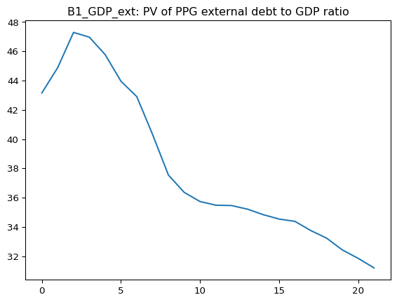

# LIC DSF Python package


## Overview

`lic-dsf` is a Python package for running selected outputs from the IMF/World Bank LIC DSF (Low-Income Country Debt Sustainability Framework) Excel template without needing to drive Excel itself. The goal is to make the model easier to integrate into programmatic workflows (batch scenario runs, reproducible pipelines, automated reporting) while staying faithful to the workbook’s calculations.

Our approach is “target-driven” rather than “export-the-whole-spreadsheet”. We started from the specific indicators we want to compute (currently just the outputs of the B1, B3, and B4 stress tests), traced the workbook cells those indicators depend on, and translated that minimal slice of formulas and constants into equivalent Python. This keeps execution focused on the parts of the model that matter for a given scenario, and makes it possible to re-run after input changes without recomputing unrelated logic.

The user-facing modules are `entrypoint.py` and `setters.py`. Entrypoint functions take a context object and return structured outputs. Inputs can be set on the context object either from a filled-out LIC DSF workbook or via typed `set_*` methods (including year-series setters for common time-series inputs).

The lic-dsf package is being developed by Teal Insights for Nature Finance, but is published under an open-source license.

 

**Disclaimer:** This is very much an alpha version. The API is subject to change. Please report any issues you encounter; we are eager to receive your feedback.

## Usage

### Setting inputs

When computing target outputs, you will pass a `LicDsfContext` object that contains your input data for the computation. This object is created by calling the `make_context()` factory function, and it will be pre-populated with the default inputs from [the IMF’s master LIC DSF Excel workbook template](https://thedocs.worldbank.org/en/doc/f0ade6bcf85b6f98dbeb2c39a2b7770c-0360012025/original/LIC-DSF-IDA21-Template-08-12-2025-vf.xlsm).

#### Loading inputs from a filled-out LIC DSF template

The easiest way to set inputs is to load them from a real LIC DSF template that’s already filled out. In this example, we load an example LIC DSF country workbook and then read its inputs into our context:

``` python
from pathlib import Path
from urllib.request import urlretrieve

from lic_dsf.entrypoint import make_context, compute_b1_pv_of_ppg_external_debt_to_gdp_ratio

workbook_path = "example.xlsm"

ctx = make_context()
ctx.load_inputs_from_workbook(workbook_path)
```

Note that the workbook must use the *latest* (August 2025) version of the IMF’s master LIC DSF Excel workbook template.

#### Setting inputs manually

You can also set inputs using the generated `set_*` methods on `LicDsfContext`. These setters update the context in-place and return an “assignment” object that describes what was applied.

The export includes multiple setter shapes:

- **Year-series setters (wide year rows)**: accept either a mapping of `year -> value` or a contiguous sequence plus `start_year`, and return a `YearSeriesAssignment`.
- **Range setters (non-year scalar / 1D / 2D ranges)**: accept a scalar, a 1D sequence, or a 2D sequence (depending on the target shape), and return a `RangeAssignment`.
- **Year-row setters (tall sparse tables)**: time-series-like API where a year may map to multiple cells; accepts a mapping or sequence plus `start_year`, and returns a `YearRowAssignment`.

``` python
# Year-series: set specific years, or provide a contiguous series starting at start_year.
ctx.set_ext_debt_data_interest({2024: 0.05})
ctx.set_ext_debt_data_interest([0.05], start_year=2024)

# Range: set a non-year scalar/range input (shape depends on the underlying target).
ctx.set_input_1_basics_discount_rate(0.05)

# Year-row: set a value for a year that fans out to multiple cells in a sparse table.
ctx.set_input_5_local_debt_financing_g00190_by_year({2024: 123.0})
```

For the full list of setters, run:

``` python
from lic_dsf.setters import LicDsfContext

setters = sorted(
    name
    for name in dir(LicDsfContext)
    if name.startswith("set_") and callable(getattr(LicDsfContext, name, None))
)

print("\n".join(setters))
```

    set_blend_floating_calculations_wb_g00002
    set_blend_floating_calculations_wb_g00003
    set_blend_floating_calculations_wb_ida_new_blend_floating
    set_blend_floating_calculations_wb_sheet_10_year
    set_blend_floating_calculations_wb_sheet_12_year
    set_blend_floating_calculations_wb_sheet_15_year
    set_blend_floating_calculations_wb_sheet_1_year
    set_blend_floating_calculations_wb_sheet_20_year
    set_blend_floating_calculations_wb_sheet_25_year
    set_blend_floating_calculations_wb_sheet_2_year
    set_blend_floating_calculations_wb_sheet_30_year
    set_blend_floating_calculations_wb_sheet_3_year
    set_blend_floating_calculations_wb_sheet_4_year
    set_blend_floating_calculations_wb_sheet_5_year
    set_blend_floating_calculations_wb_sheet_6_year
    set_blend_floating_calculations_wb_sheet_7_year
    set_blend_floating_calculations_wb_sheet_8_year
    set_blend_floating_calculations_wb_sheet_9_year
    set_ext_debt_data_interest
    set_ext_debt_data_nominal_value_pv_of_st_debt_locally_issued_debt
    set_ext_debt_data_principal
    set_input_1_basics_discount_rate
    set_input_1_basics_first_year_of_projections
    set_input_3_macro_debt_data_dmx_current_account
    set_input_3_macro_debt_data_dmx_debt_relief_non_multilateral_hipc
    set_input_3_macro_debt_data_dmx_exports_of_goods_and_services
    set_input_3_macro_debt_data_dmx_government_grants
    set_input_3_macro_debt_data_dmx_government_primary_expenditures_this_used_to_be_total_expenditure
    set_input_3_macro_debt_data_dmx_government_revenue_and_grants
    set_input_3_macro_debt_data_dmx_gross_domestic_product_us_dollars
    set_input_3_macro_debt_data_dmx_ida_50y_loans
    set_input_3_macro_debt_data_dmx_ida_new_40_year_credits
    set_input_3_macro_debt_data_dmx_ida_new_60_year_credits
    set_input_3_macro_debt_data_dmx_ida_new_blend
    set_input_3_macro_debt_data_dmx_ida_new_regular
    set_input_3_macro_debt_data_dmx_ida_sml
    set_input_3_macro_debt_data_dmx_imports_of_goods_and_services_enter_as_a_positive_number
    set_input_3_macro_debt_data_dmx_multilateral1
    set_input_3_macro_debt_data_dmx_national_currency_per_u_s_dollar_e_o_p
    set_input_3_macro_debt_data_dmx_national_currency_per_u_s_dollar_p_a
    set_input_3_macro_debt_data_dmx_new_gross_disbursement_central_bank
    set_input_3_macro_debt_data_dmx_other_debt_creating_or_reducing_flow_please_specify
    set_input_3_macro_debt_data_dmx_outstanding_of_existing_debt_in_local_currency
    set_input_3_macro_debt_data_dmx_ppg_external_debt_interest_due
    set_input_3_macro_debt_data_dmx_ppg_mlt_external_debt_outstanding
    set_input_3_macro_debt_data_dmx_ppg_st_external_debt_outstanding
    set_input_3_macro_debt_data_dmx_ppg_total_external_debt_amortization_due
    set_input_3_macro_debt_data_dmx_private_external_debt_interest_due
    set_input_3_macro_debt_data_dmx_private_mlt_external_debt_amortization_due
    set_input_3_macro_debt_data_dmx_private_sector_mlt_external_debt_outstanding
    set_input_3_macro_debt_data_dmx_private_sector_st_external_debt_outstanding
    set_input_3_macro_debt_data_dmx_privatization_proceeds
    set_input_3_macro_debt_data_dmx_real_gross_domestic_product
    set_input_3_macro_debt_data_dmx_recognition_of_contingent_liabilities_e_g_bank_recapitalization
    set_input_3_macro_debt_data_dmx_total_principal_payment
    set_input_4_external_financing_com3
    set_input_4_external_financing_com3_2
    set_input_4_external_financing_com3_3
    set_input_4_external_financing_com4
    set_input_4_external_financing_com4_2
    set_input_4_external_financing_com4_3
    set_input_4_external_financing_com5
    set_input_4_external_financing_com5_2
    set_input_4_external_financing_com5_3
    set_input_4_external_financing_commecial_bank
    set_input_4_external_financing_commecial_bank_2
    set_input_4_external_financing_commecial_bank_3
    set_input_4_external_financing_eurobond
    set_input_4_external_financing_eurobond_2
    set_input_4_external_financing_eurobond_3
    set_input_4_external_financing_export_credit_agencies
    set_input_4_external_financing_export_credit_agencies_2
    set_input_4_external_financing_export_credit_agencies_3
    set_input_4_external_financing_export_import_bank_of_npc
    set_input_4_external_financing_export_import_bank_of_npc_2
    set_input_4_external_financing_export_import_bank_of_npc_3
    set_input_4_external_financing_ida_50y_loans
    set_input_4_external_financing_ida_50y_loans_2
    set_input_4_external_financing_ida_50y_loans_3
    set_input_4_external_financing_ida_50y_loans_4
    set_input_4_external_financing_ida_blend
    set_input_4_external_financing_ida_blend_2
    set_input_4_external_financing_ida_blend_3
    set_input_4_external_financing_ida_new_40_year_credits
    set_input_4_external_financing_ida_new_40_year_credits_2
    set_input_4_external_financing_ida_new_40_year_credits_3
    set_input_4_external_financing_ida_new_40_year_credits_4
    set_input_4_external_financing_ida_new_60_year_credits
    set_input_4_external_financing_ida_new_60_year_credits_2
    set_input_4_external_financing_ida_new_blend_also_enter
    set_input_4_external_financing_ida_new_blend_also_enter_2
    set_input_4_external_financing_ida_new_blend_also_enter_3
    set_input_4_external_financing_ida_new_regular
    set_input_4_external_financing_ida_new_regular_2
    set_input_4_external_financing_ida_regular
    set_input_4_external_financing_ida_regular_2
    set_input_4_external_financing_ida_regular_3
    set_input_4_external_financing_ida_small_economy
    set_input_4_external_financing_ida_small_economy_2
    set_input_4_external_financing_ida_small_economy_3
    set_input_4_external_financing_ida_sml
    set_input_4_external_financing_ida_sml_2
    set_input_4_external_financing_ida_sml_3
    set_input_4_external_financing_ida_sml_4
    set_input_4_external_financing_imf
    set_input_4_external_financing_imf_2
    set_input_4_external_financing_imf_3
    set_input_4_external_financing_multi1
    set_input_4_external_financing_multi1_2
    set_input_4_external_financing_multi1_3
    set_input_4_external_financing_multi2
    set_input_4_external_financing_multi2_2
    set_input_4_external_financing_multi2_3
    set_input_4_external_financing_npc2
    set_input_4_external_financing_npc2_2
    set_input_4_external_financing_npc2_3
    set_input_4_external_financing_npc3
    set_input_4_external_financing_npc3_2
    set_input_4_external_financing_npc3_3
    set_input_4_external_financing_npc4
    set_input_4_external_financing_npc4_2
    set_input_4_external_financing_npc4_3
    set_input_4_external_financing_npc5
    set_input_4_external_financing_npc5_2
    set_input_4_external_financing_npc5_3
    set_input_4_external_financing_oth_multi1
    set_input_4_external_financing_oth_multi1_2
    set_input_4_external_financing_oth_multi1_3
    set_input_4_external_financing_oth_multi2
    set_input_4_external_financing_oth_multi2_2
    set_input_4_external_financing_oth_multi2_3
    set_input_4_external_financing_oth_multi3
    set_input_4_external_financing_oth_multi3_2
    set_input_4_external_financing_oth_multi3_3
    set_input_4_external_financing_ppg_st_external_debt
    set_input_5_local_debt_financing_bonds_1_to_3_years_fx
    set_input_5_local_debt_financing_bonds_1_to_3_years_lc
    set_input_5_local_debt_financing_bonds_4_to_7_years_fx
    set_input_5_local_debt_financing_bonds_4_to_7_years_lc
    set_input_5_local_debt_financing_bonds_beyond_7_years_fx
    set_input_5_local_debt_financing_bonds_beyond_7_years_lc
    set_input_5_local_debt_financing_central_bank_financing
    set_input_5_local_debt_financing_g00190_by_year
    set_input_5_local_debt_financing_g00191
    set_input_5_local_debt_financing_t_bills_denominated_in_foreign_currency
    set_input_5_local_debt_financing_t_bills_denominated_in_local_currency
    set_input_6_optional_standard_test_current_transfers_to_gdp_and_fdi_to_gdp_ratios_set_to_their_historical_average_minus_one_sd_or_baseline_projection_minus_one_sd_whichever_is_lower_in_the_second_and_third_years_of_the_projection_period
    set_input_6_optional_standard_test_nominal_export_growth_in_usd_set_to_its_historical_average_minus_one_sd_or_baseline_projection_minus_one_sd_whichever_is_lower_in_the_second_and_third_years_of_the_projection_period
    set_input_6_optional_standard_test_other_flows_fdi_shock_of_standard_deviations
    set_input_6_optional_standard_test_real_gdp_growth_set_to_its_historical_average_minus_one_sd_or_baseline_projection_minus_one_sd_whichever_is_lower_for_the_second_and_third_years_of_the_projection_period
    set_input_8_sdr_sdr_allocation_in_million_of_usd
    set_input_8_sdr_sdr_holdings_in_million_of_usd
    set_input_8_sdr_sdr_interest_rate
    set_inputs
    set_pv_base_base
    set_pv_base_base_10
    set_pv_base_base_11
    set_pv_base_base_12
    set_pv_base_base_13
    set_pv_base_base_14
    set_pv_base_base_15
    set_pv_base_base_16
    set_pv_base_base_17
    set_pv_base_base_18
    set_pv_base_base_19
    set_pv_base_base_2
    set_pv_base_base_20
    set_pv_base_base_21
    set_pv_base_base_22
    set_pv_base_base_23
    set_pv_base_base_24
    set_pv_base_base_25
    set_pv_base_base_26
    set_pv_base_base_27
    set_pv_base_base_28
    set_pv_base_base_3
    set_pv_base_base_4
    set_pv_base_base_5
    set_pv_base_base_6
    set_pv_base_base_7
    set_pv_base_base_8
    set_pv_base_base_9
    set_pv_base_g00209
    set_pv_base_ida_regular
    set_pv_stress_alternative_scenario_1_key_variables_at_historical_average
    set_start_debt_sustainability_analysis

### Computing target outputs

We currently export four public functions for each of three stress test tabs: B1_GDP_ext, B3_Exports_ext, and B4_other flows_ext. Each function takes a `ctx` argument and returns a dictionary of output ranges and their computed values.

``` python
from lic_dsf.entrypoint import (
    compute_b1_pv_of_ppg_external_debt_to_gdp_ratio,
    compute_b1_pv_of_ppg_external_debt_to_exports_ratio,
    compute_b1_ppg_debt_service_to_exports_ratio,
    compute_b1_ppg_debt_service_to_revenue_ratio,
    compute_b3_pv_of_ppg_external_debt_to_gdp_ratio,
    compute_b3_pv_of_ppg_external_debt_to_exports_ratio,
    compute_b3_ppg_debt_service_to_exports_ratio,
    compute_b3_ppg_debt_service_to_revenue_ratio,
    compute_b4_pv_of_ppg_external_debt_to_gdp_ratio,
    compute_b4_pv_of_ppg_external_debt_to_exports_ratio,
    compute_b4_ppg_debt_service_to_exports_ratio,
    compute_b4_ppg_debt_service_to_revenue_ratio
)
```

For example, to run the B1_GDP_ext stress test, you can call:

``` python
result = compute_b1_pv_of_ppg_external_debt_to_gdp_ratio(ctx=ctx)
print(result)
```

    {'B1_GDP_ext!C35:B1_GDP_ext!X35': array([[42.92396948601662, 44.88462374681342, 47.288958254302656,
            46.96482551036836, 45.77330421009148, 43.95325728266726,
            42.903598974163096, 40.31390358529325, 37.543348741187636,
            36.35839667684007, 35.73258755700471, 35.48513143901,
            35.457648621450446, 35.21233578112659, 34.83533923839333,
            34.535851320397484, 34.378982576924976, 33.75408803253864,
            33.23412133147747, 32.426152108430394, 31.851681785766832,
            31.20177834629951]], dtype=object)}

If we adjust inputs to re-run the scenario with different assumptions, only the parts of the computation that depend on the changed inputs will be re-run, which makes the computation faster and more efficient.

For example, if we add 100 million USD of short-term locally issued debt for 2023 and adjust the interest rate on this debt for 2024 to 0.07, we can re-run the computation like this:

``` python
ctx.set_ext_debt_data_nominal_value_pv_of_st_debt_locally_issued_debt({2023: 100})
ctx.set_ext_debt_data_interest({2024: 0.07})
result = compute_b1_pv_of_ppg_external_debt_to_gdp_ratio(ctx=ctx)
print(result)
```

    {'B1_GDP_ext!C35:B1_GDP_ext!X35': array([[43.15773520571983, 44.88462374681342, 47.288958254302656,
            46.96482551036836, 45.77330421009148, 43.95325728266726,
            42.903598974163096, 40.31390358529325, 37.543348741187636,
            36.35839667684007, 35.73258755700471, 35.48513143901,
            35.457648621450446, 35.21233578112659, 34.83533923839333,
            34.535851320397484, 34.378982576924976, 33.75408803253864,
            33.23412133147747, 32.426152108430394, 31.851681785766832,
            31.20177834629951]], dtype=object)}

We can visualize the results by plotting the computed values for each year:

``` python
import matplotlib.pyplot as plt

plt.plot(result['B1_GDP_ext!C35:B1_GDP_ext!X35'].flatten())
plt.title('B1_GDP_ext: PV of PPG external debt to GDP ratio')
plt.show()
```


