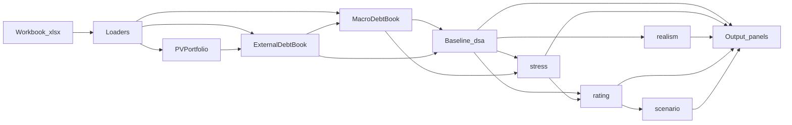

# Excel → Python map

One-page lookup from familiar LIC-DSF sheets to `lic_dsf` types and demos.

## Pipeline

## Sheet map

| Excel | Package / type | Demo |
|-------|----------------|------|
| Input 4 / `PV_Base` | `PresentValueInstrument`, `load_instruments_from_workbook` | [`pv`](../demo/pv.ipynb) |
| Input 5 / `PV_LC_NR*` | `LocalCurrencyNonResidentInstrument`, `load_lc_nr_instruments_from_workbook` | [`lc_nr`](../demo/lc_nr.ipynb) |
| Combined new MLT | `PVPortfolio` | [`portfolio`](../demo/portfolio.ipynb) |
| `Ext_Debt_Data` | `ExternalDebtBook`, `load_external_debt_inputs` | [`ext_debt`](../demo/ext_debt.ipynb) |
| `Dom_Debt_Data` / indicators | `DomesticDebtBook`, `load_domestic_debt_inputs` | [`dom_debt`](../demo/dom_debt.ipynb) |
| `Macro-Debt_Data` | `MacroDebtBook`, `load_macro_debt_inputs` | [`macro_debt`](../demo/macro_debt.ipynb) |
| Input 7 residual terms | `load_input7_residual_params`, `ResidualFinancingParams` | used in stress demos |
| Baseline – external / public | `BaselineExternalBook`, `BaselinePublicBook` | [`baseline_dsa`](../demo/baseline_dsa.ipynb) |
| Output 1-1 / 1-2 | `external_dsa_panel`, `public_dsa_panel` | [`baseline_dsa`](../demo/baseline_dsa.ipynb) |
| Input 6 standard stresses | `load_input6_standard`, `run_standard_external_stress`, … | [`stress_dsa`](../demo/stress_dsa.ipynb) |
| Output 2 / 3 (B / B1 paths) | `stress_external_panel`, `stress_public_panel` | [`stress_dsa`](../demo/stress_dsa.ipynb) |
| Realism 1–4 / Output 4 | `lic_dsf.realism` panels + loaders | [`realism`](../demo/realism.ipynb) |
| CI Summary / Classification | `load_ci_summary`, `DebtCarryingCapacity`, thresholds | [`risk_rating`](../demo/risk_rating.ipynb) |
| Chart Data / Output 5 / 7 | `ChartDataRegistry`, `compute_mechanical_ratings`, `risk_summary_panel` | [`output_7`](../demo/output_7.ipynb), [`risk_rating`](../demo/risk_rating.ipynb) |
| Customized Scenario / Probability / Output 6 | `CustomizedScenarioSpec`, `probability_panel` | [`all_outputs`](../demo/all_outputs.ipynb) |
| Full Outputs tour | all of the above | [`all_outputs`](../demo/all_outputs.ipynb) |

## Package roles (one line each)

| Package | Owns | Does not own |
|---------|------|--------------|
| `lic_dsf.pv` | Instruments, Ext/Dom/Macro books, Input loaders, ResFin instrument math | Baseline ratio panels, ratings |
| `lic_dsf.dsa` | Baseline external/public sustainability ratios | Stress shocks, CI thresholds |
| `lic_dsf.stress` | Input 6 shocks, ResFin overlays, B/B1 paths | Baseline-only math, final rating |
| `lic_dsf.realism` | Realism 1–4 / Output 4 tools | Chart Data, risk ratings |
| `lic_dsf.rating` | CI thresholds, breaches, mechanical ratings, Output 5/7 | DSA ratio numerators |
| `lic_dsf.scenario` | Customized paths, probability / Output 6 | Input 8 SDR (lives in Ext via `pv`) |

---

**Next:** [2. Getting started](02-getting-started.md)
